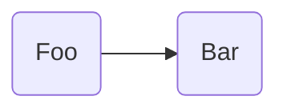

## Hello world

Here's code:

```js
foobar(); // a comment
```

## Here's footnote

a [link](https://github.com/jsade) here. Deserunt[^1] ullamco aliquip commodo voluptate. Consequat labore qui magna tempor consequat esse eiusmod velit elit deserunt enim minim. Id magna occaecat minim est incididunt reprehenderit. Anim incididunt proident nulla et in esse excepteur labore id non enim. Est ex velit veniam laboris velit do non proident qui ullamco minim mollit. Excepteur in veniam reprehenderit commodo ipsum.

### And an image


## Then some text and mermaid

asdadda

Amet officia minim consequat commodo. Eiusmod excepteur non irure nulla ullamco enim labore nulla. Ullamco laboris id nulla id enim exercitation consequat.

> This is a note callout from Obsidian.
{: .prompt-info }

> This is a note callout from Obsidian.
{: .prompt-tip }

## I'll add a list here

- [x] Test list A [completion:: 2025-02-21]
- [x] Test list B (#Project/Testing) (People::Sophia) [completion:: 2025-02-21]

Veniam consequat officia voluptate exercitation deserunt laboris mollit nostrud. Exercitation anim eu officia laborum deserunt aliquip dolore ex consectetur dolor et id.



[^1]: Foobar some footnote