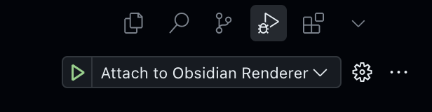
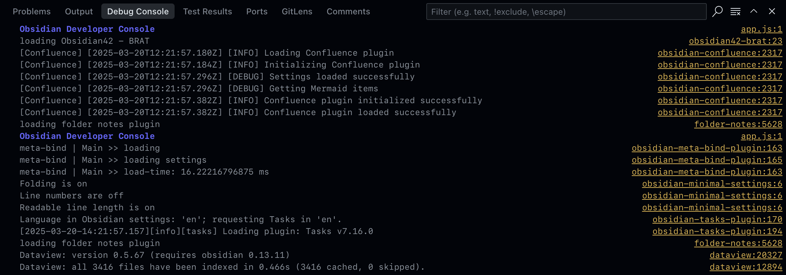
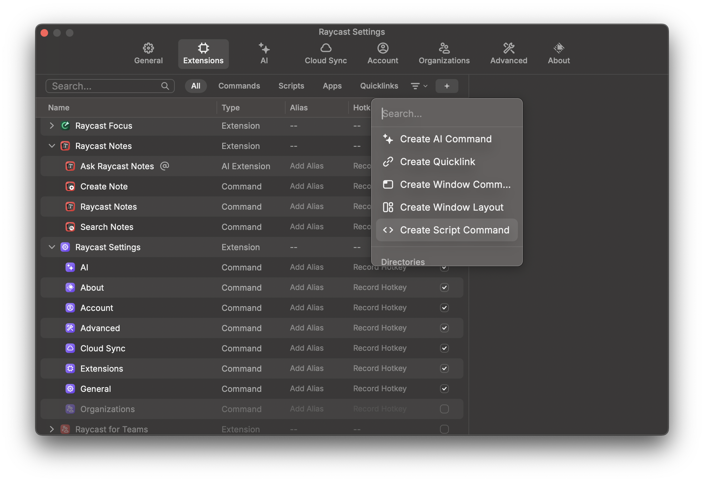

<!--
This file was automatically converted by Jekyll Publisher for Obsidian.
https://github.com/jsade/obsidian-jekyll-plugin

Version: 1.0.1
Conversion date: 2025-04-26 18:56:06 +0000
-->


When developing plugins or themes for [Obsidian](https://obsidian.md), debugging can be challenging without proper tools.

This guide demonstrates how to connect Visual Studio Code's powerful debugger to Obsidian, allowing you to view console logs, set breakpoints, and inspect variables directly from your development environment.

> This guide focuses on macOS setup. Windows and Linux users will need to adapt the launch commands for their respective operating systems.
{: .prompt-info }
## The process

### Setting up the Visual Studio Code debugger configuration

Create a file `.vscode/launch.json` to your VS Code project's root and copy this to it:

```json
{
	"configurations": [
		{
			"name": "Attach to Obsidian Renderer",
			"port": 9222,
			"request": "attach",
			"type": "chrome",
			"webRoot": "${workspaceFolder}"
		}
	],
	"version": "0.2.0"
}
```

This configuration tells VS Code to connect to a Chrome debugging protocol on port 9222, which is what Obsidian will expose when we launch it with the right parameters. The `webRoot` setting ensures that VS Code can correctly map file paths between your project and the running application.

If you're working on multiple Obsidian plugins simultaneously, you might want to create separate launch configurations for each project with descriptive names.

### Launch Obsidian with remote debugging enabled

Launch Obsidian from terminal with these arguments:

```shell
open -n /Applications/Obsidian.app --args --enable-debug-logging --remote-debugging-port=9222
```

Here's what these parameters do:

- `open -n` opens a new instance of the application
- `--enable-debug-logging` increases the verbosity of console output
- `--remote-debugging-port=9222` exposes Chrome DevTools Protocol on port 9222

I am not completely certain whether `--enable-debug-logging` is required but haven't tested this without it.

Launching a new instance is particularly useful when you want to keep your regular Obsidian vault separate from your development environment. This way, you can have a dedicated testing vault without risking your main data.

### Start the VS Code debugger

Locate the debugger from the _Activity bar_ and **click the play button** on _Attach to Obsidian Renderer_. You should immediately see it attaching to Obsidian.



To have the VS Code debugger always visible you can pin it to the Activity Bar from its dropdown menu.

Once connected, you'll have access to all the standard debugging tools VS Code offers:

- Breakpoints can be set by clicking in the gutter next to line numbers
- The Variables panel shows local and global variables when execution pauses
- The Call Stack panel shows the execution path when paused
- You can use conditional breakpoints and logpoints for more advanced debugging

### Observe Debug Console

And voilá! You got all `console.logs` and traces straight in your VS Code's **Debug Console**.



The Debug Console provides several advantages over Obsidian's built-in developer tools:

- Console output is preserved between debugging sessions
- You can directly execute JavaScript in the context of the running Obsidian instance
- Complex objects are interactive and expandable for detailed inspection

When developing plugins, you can add strategic `console.log()` statements or use the more structured `console.table()` for displaying tabular data. The Debug Console preserves ANSI color codes, so you can also use libraries like `chalk` to make your debug output more readable.

## Create a shortcut for launching Obsidian with remote debugging

You don't need to remember all the Obsidian launch parameters if you create a shortcut. Below you can find instructions for [Raycast](https://raycast.com/?via=juha-sadeharju), Terminal, and Automator

### Creating a Raycast shortcut

If you yet haven't done so, I strongly suggest installing [Raycast](https://raycast.com/?via=juha-sadeharju) to your MacOS. It 's a multipurpose tool masking as a quick launcher and a Spotlight replacement. It will do wonders to your workflow.

Open Raycast settings with **⌘** + **,** and under Extensions click the **+** menu where you find **Create Script Command**.



Fill in the following details:

- Name: "Debug Obsidian"
- Description: "Launch Obsidian with remote debugging enabled"
- Mode: "Script"
- Language: "Bash"
- Template: "No Template"

In the script editor, paste:

```bash
#!/bin/bash

# Launches Obsidian with remote debugging enabled
open -n /Applications/Obsidian.app --args --enable-debug-logging --remote-debugging-port=9222

echo "Obsidian launched with debugging on port 9222"
```

Save the command, and now you can quickly launch Obsidian in debug mode by invoking Raycast and typing "Debug Obsidian".

### Creating a terminal shortcut

In your Terminal session, run:

```shell
alias debugobsidian="open -n /Applications/Obsidian.app --args --enable-debug-logging --remote-debugging-port=9222"
```

Now you can just type `debugobsidian`to launch it. This alias will only persist for your current terminal session, so if you close your terminal, you'll need to create it again.

#### Create a permanent alias

To have the alias available every time you open a new terminal session, you can add the alias to your shell profile. Assuming you're on a recent MacOS and you haven't switched away from the default shell (`.zshrc`), open the Terminal, copy/paste these 8 lines into it, and press enter:

```properties
cat <<'EOF' >> ~/.zshrc
# Launch Obsidian with remote debugger enabled:
# Set the preferred alias name; defaults to "debugobsidian" if not already set
: ${OBS_DEBUG_ALIAS:="debugobsidian"}

# Create the alias using the chosen name
alias "$OBS_DEBUG_ALIAS"="open -n /Applications/Obsidian.app --args --enable-debug-logging --remote-debugging-port=9222"
EOF
```

Now you have `debugobsidian` available to you each time you open a new Terminal session.

If you wish to test it in your existing session, source the profile file to activate the alias, and run `debugobsidian`:

```shell
source ~/.zshrc
debugobsidian
```

### Create a MacOS Automator App

1. Open **Automator** app
2. Select **New Document** → **Application**
3. Drag **Run Shell Script** into the workflow and **paste your launch command**:

   ```shell
   open -n /Applications/Obsidian.app --args --enable-debug-logging --remote-debugging-port=9222
   ```

4. Save as _"Debug Obsidian"_ (or as whatever you prefer) to your Applications folder
5. Optional: Give your app a custom icon by:
   - Finding the saved app in Finder
   - Right-clicking and selecting "Get Info"
   - Dragging an image file onto the icon in the top-left of the info window

Now you'll have a dedicated app you can add to your Dock or launch from Spotlight for quick access to Obsidian in debug mode.

## Final words

Setting up the VS Code debugger with Obsidian improves the development workflow when building plugins or themes. This connection gives you direct access to console outputs, breakpoints, and variable inspection in real-time.

This approach eliminates the need to constantly switch between applications and provides more robust debugging capabilities than basic console methods. Whether you're developing a complex plugin or making simple customizations, having proper debugging tools makes the process more efficient.

If you have questions or suggestions about this setup, feel free to share them in the comments below.
